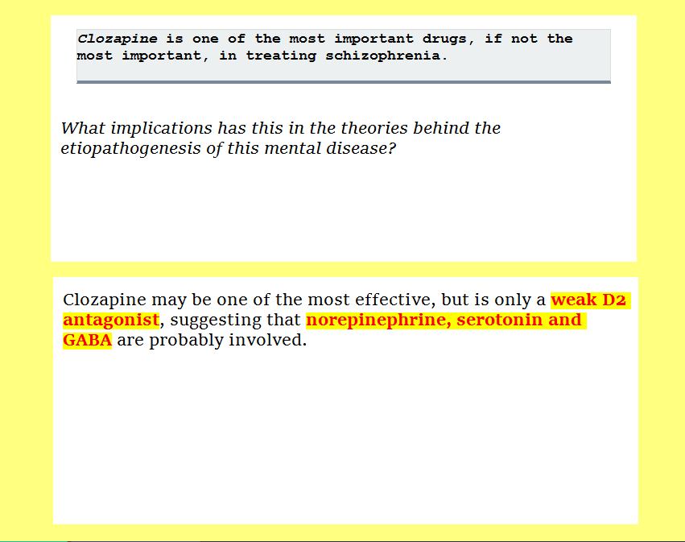

> The answer field is **useless**. 

*I've to thank Naess for all the insightful discussion on this topic. I'll be basically reporting my own thoughts on what he explained to me about this topic. It had me think for multiple days about it and I felt the need to put it down for others to read.*

Why is the answer field useless? 

As a good rule of thumb, it's a popular statement among the SM.Wiki Discord that "You remember what's in the answer field." However, the title of this article implies that the value is not found in the answer field. It's not intuitive or easy to understand the meaning lying behind the question in the title. 

So, another rule about clozes is that they have to be atomic. Atomic means that they must not contain more than one new piece of knowledge. It should come to us without a need for further explanation that if you have a cloze with just one new piece of knowledge, that unit should be in the **answer field** because that's what you will remember. So, the focus of our flashcard making should be having a very simple question field and the shortest possible answer field; if you had a complicated question, it wouldn't make the cut for the atomic requirement and a complex answer could have more than one new unit of knowledge. 

Now, that is indeed correct. However, it is correct as long as you think of clozes as syntactical beings, not semantic ones. Those are the two concepts that Naess introduced in [this video](https://youtu.be/p8Mgws7Hecc). 

You can think of a syntactic cloze as something like: 

`Q: A DNA polymerase is a member of a family of enzymes that catalyze the [...] of DNA molecules from nucleoside triphosphates, the molecular precursors of DNA.`

`A: synthesis`

You should also try to make it as short as possible, since right now it already has too much information that could mislead you, make it too easy or just new information that you don't know and therefore should be inside a different set of flashcards. 

`Q: A DNA polymerase catalyzes the [...] of DNA molecules.`

`A: synthesis`

However, "catalyze" still gives away a lot and "DNA molecules" too. Assuming that you know what the verb catalyze means and you have a broad idea of what DNA molecules are - in the case you don't, you should make a flashcard for each info - a beginner would do something like this. 

`Q: A DNA polymerase catalyzes the synthesis of [...].`

`A: DNA molecules`

They would probably make two clozes for this piece of knowledge. Redundancy can help and it would probably stick, but it's still going to be lacking. You want one very good flashcard, otherwise you are at risk for inefficacy and overload. 

These above are examples of **syntactic clozes**, which characteristics are: 

* Atomicity
* Universality
* Recyclability
* Good for Learning (e.g. not just recalling)
* Easiness, which does not mean necessarily bad
* Far for practicality. 

  * They can be useless for exams or real situations, since they're just bricks, not solid buildings. 
* Huge amounts of them are needed to learn about a subject

If you were learning only through flashcards (e.g. Anki pre made decks), then you would need atomic and very short clozes to be as clear and universal as possible. That's because you're building asemantic knowledge, with almost no connection whatsoever with the rest of the world. So, if someone made a deck with the precise intent of having people learn from it, clozes like these ones would be the best. The downside is that, unless already made into decks, they're not practical for self-studying. You'd have to make too many of them and they would still be far from the actual exam.

Then, you could do a semantic cloze, which is closer to reality and more practical. 

`Q: A DNA polymerase is a member of a family of enzymes that [...] (about doing stuff with DNA)`

`A: catalyze the synthesis of DNA molecules from nucleoside triphosphates.`

This specific example is not that good, but still gives an idea of what a semantic cloze is. **Semantic clozes** are why the title is "The Answer Field is Useless". With this cloze, to quote Naess, you can better capture the "relationship" of knowledge. You're not taking bricks, but ready to be used constructs. 

Thing is, if you did not write down the hint between brackets, it would be too general and hard to grasp. These clozes, since the hint has a subjective component, are less universal compared to the syntactic clozes. However, they're definitely better for self-directed learning, since you need less clozes and they are similar to what an exam question could look like. 

*In semantic clozes, you can keep some fluff, some context, to facilitate your learning. This will be further examined in other articles. (Always have to thank Naess, because this is part of the insights he gave me)*

Their characteristics are: 

* Atomicity
* Lacking in universality
* Harder to recycle 
* Worse for acquiring factual knowledge
* Better for recalling 
* Harder 
* Practicality
* Less clozes needed per subject, probably 1:3 compared to syntactic clozes 

Now, now, I do agree with Naess about the superiority of semantic clozes when you're studying by yourself. However, I think that there's still another level you can work at. 

Above semantic clozes, there are what I'd call **epistemological clozes**.

First of all, in simple terms, think of epistemology as the most valid way to reach the perfect knowledge, in this case. There are many definitions and many contradictions, but just think of it as the search for the best truth for yourself or in general. 

Epistemological clozes and semantic clozes are similar, but starkly different. Here an example: 

This cloze is probably gibberish if you're not a medicine student, and even then, it's not guaranteed that you will get why this cloze is so good. 

This is not an atomic cloze, first of all. You would need to know what Clozapine, Schizophrenia and an Etiopathogenesis are. This would make this card instantly garbage to learn from a premade deck. It has too many information to be used by someone who's not me. 

The question field has multiple units of knowledge in the answer field. So, why is a flashcard that goes against the principles of making flashcards so good? 

> This is a **generalization**. 

Your professors can explain the subject to you because, at least in theory, they have a lot of experience and they created their own generalizations and rules to abide to. They extracted the essence, since it's almost impossible to remember all the details. They have the details in their peripheral vision, not in the center of it. 

When learning something, we always think of the details as bricks, little and clear pieces that we put together. Many people would, subconsciously, make an analogy with atoms and molecules. 

Details are the electrons that you put around bigger pieces of knowledge as bricks, to that you can have your atoms. Your atoms become molecule the more you dig into a subject. With time, you might think that you've now discovered the philosopher's stone. 

However, it was discovered by Heisenberg that the electrons are actually more like an electromagnetic fog that really small tennis balls. 

My opinion is that for knowledge we are looking at a similar type of constructs. 

There's not a collection of bricks to put together, we're wading through a fog with few lights around us. What we need is very bright lanterns to guide us. Those lanterns are few and very high value details about the topic you're studying. If you tried to put that fog all together as if it was made of bricks, you would only find yourself with a very confusing image. 

It must not be surprising how lawyers do not study their books to the letter. The best lawyers are good with abstraction and generalization, two fundamental skills if you're working with a huge body of material. 

> That's why the best details is an abstraction, a generalization. The famous golden nugget. 

Going on a fuzzy quest, reading a lot of different material and elaborating that through different outputs makes the person familiar with the language, an expert in the foggy swamp that is knowledge. 

There's no way to change how the environment of knowledge is laid, out, even though our institutions tried to do do that. {Add extract on valuation model of knowledge} 

In this theory, overloading your memory on the same topic means trying to brute force all that fog in one place, with the single effect that now there are a lot of fuzzy details that require even more work than before. The fog has not a precise shape, nor it possesses hints to what it should be representing. However, if we dispelled that fog and substituted that with one clear lantern, only one details or maybe two, that we're constantly rekindling (use of SRSs) those would make the space near the lanter clearer as well. 

Clear cut knowledge makes distinguishing details easier, the high value golden nuggets sets apart the topic from the rest of the knowledge, making it ultra-specific and a lighthouse for our soul.

Clozapine is a drug for schizophrenia that demonstrates that the theory that dopamine is central in schizophrenia is not really true, because clozapine is one of the most, if not the most, effective drugs in the treatment. However, clozapine is not really that powerful for dopamine receptors that activate dopamine pathways: instead, it has an effect on multiple neurotransmitters like GABA, serotonine and noradrenaline. 

I wrote this down from memory because that one card is a beacon of light in the sea of details that is medicine. 

Nietzsche said that quotes and abstractions from ancient authors are like the peaks of mountains, but we try to approach those authors as if we were trying to walk from one peak to another with legs long kilometers. In reality, the only thing we're doing is free falling from insane heights. We need to put the groundwork, to earn those generalizations. 

This is why you cannot use epistemological clozes for premade decks or you can't really share them. They are personal, you have earned them. I had to watch three videos on schizophrenia and I already knew about clozapine quite well. So, I made my own generalization that stuck like glue to my mind. Even if I explained my generalization, it wouldn't be the same thing. There's fog around my lantern, there are fuzzy details that are part of the needed landscape of knowledge. 

They are hard to create because you have to explore a lot. You can't just read your textbook and demand to be creating epistemological clozes on the go. 

So, they do have fuzzy details like **semantic clozes**, but the details you put in an epistemological cloze are those that *you* chose to have there. There is not anything left to chance. You built your own understanding and you're now choosing to have a lantern that can be bigger or smaller based on the need.

*I'm still currently editing and re-writing some parts. I was eager to publish my first real post, so pardon me for the lack of good formatting and coherence.*